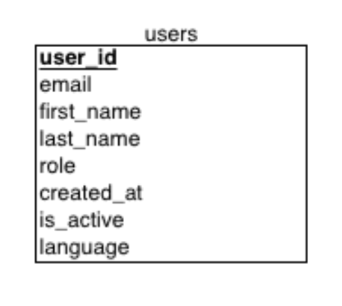

# Localization Guide

This document explains how localization is implemented in the project.

## Overview

The project uses a localization framework [react-i18next](https://www.npmjs.com/package/react-i18next) to support 3 languages and provide a seamless experience for users from English, Japanese, and Russia n-speaking backgrounds. The localization files are stored in JSON format, with each language having its own directory containing the translation files pointed to the file structure location.

## Database Layer

In the application user default language is stored in the database as part of the user profile. This allows the application to load the appropriate localization files based on the user's language preference when they log in.

User language added to the users table as follows:



## Dependencies

The following dependencies are used for localization:

- `i18next`: Core internationalization framework.
- `react-i18next`: React bindings for i18next.

- `next-i18n-router`: Next.js routing with i18n support.
- `i18next-resources-to-backend`: Backend plugin for loading localization resources.

To install the required dependencies, run the following command:
```
  npm install i18next react-i18next i18next-resources-to-backend next-i18n-router
```
## Configuration

**1. Create a config**

Add a file at the root of your project called i18nConfig.js.

```javascript
const i18nConfig = {
  locales: ['en', 'ja', 'ru'],
  defaultLocale: 'en'
};

module.exports = i18nConfig;
```

**2. Set up dynamic segment**

In your Next.js pages directory, create a folder named [locale] to handle dynamic locale segments in the URL structure.

```
/app
  /[locale]
    /example
      example.tsx
    ...
  layout.tsx
  page.tsx
i18n.ts
```

**3. Create Middleware**

Finally, at the root of your project, add a middleware.ts file.

```javascript
import { i18nRouter } from 'next-i18n-router';
import i18nConfig from './i18nConfig';

export function middleware(request) {
  return i18nRouter(request, i18nConfig);
}

// applies this middleware only to files in the app directory
export const config = {
  matcher: '/((?!api|static|.*\\..*|_next).*)'
};
```

After restarting our server, we can now visit our home page successfully at /, /ja, and /ru.

## Locales Directory Structure

The localization files in a root directory are stored in the following directory structure:

```
/locales
  /en
    example.json
  /ja
    example.json
  /ru
    example.json
  ...
``` 

Each language directory (e.g., `en`, `ja`, `ru`) contains a `example.json` file that holds the key-value pairs for translations used throughout the application.

## Loading and Rendering Translations

### Server component with react-i18next

Create a file in my /app directory called i18n.js that contains a function to generate an i18next instance:

```javascript
import { createInstance } from 'i18next';
import { initReactI18next } from 'react-i18next/initReactI18next';
import resourcesToBackend from 'i18next-resources-to-backend';
import i18nConfig from '@/i18nConfig';

export default async function initTranslations(
  locale,
  namespaces,
  i18nInstance,
  resources
) {
  i18nInstance = i18nInstance || createInstance();
  
  i18nInstance.use(initReactI18next);
  
  if (!resources) {
    i18nInstance.use(
      resourcesToBackend(
        (language, namespace) =>
          import(`@/locales/${language}/${namespace}.json`)
      )
    );
  }
  
  await i18nInstance.init({
    lng: locale,
    resources,
    fallbackLng: i18nConfig.defaultLocale,
    supportedLngs: i18nConfig.locales,
    defaultNS: namespaces[0],
    fallbackNS: namespaces[0],
    ns: namespaces,
    preload: resources ? [] : i18nConfig.locales
  });
  
  return {
    i18n: i18nInstance,
    resources: { [locale]: i18nInstance.services.resourceStore.data[locale] },
    t: i18nInstance.t
  };
}
```

Now use this function to generate an i18next instance that will translate text on your home page:

```javascript
import styles from './page.module.css';
import ExampleClientComponent from '@/components/ExampleClientComponent';
import initTranslations from '../i18n';

export default async function Home({ params: { locale } }) {
  const { t } = await initTranslations(locale, ['home']);
  
  return (
    <main className={styles.main}>
      <h1>{t('header')}</h1>
      <ExampleClientComponent />
    </main>
  );
}
```

In this example, we are reading the locale from our params and passing it into initTranslations.

### Client component with react-i18next

Make a TranslationsProvider in components/TranslationsProvider.tsx:

```javascript
'use client';

import { I18nextProvider } from 'react-i18next';
import initTranslations from '@/app/i18n';
import { createInstance } from 'i18next';

export default function TranslationsProvider({
  children,
  locale,
  namespaces,
  resources
}) {
  const i18n = createInstance();
  
  initTranslations(locale, namespaces, i18n, resources);
  
  return <I18nextProvider i18n={i18n}>{children}</I18nextProvider>;
}
```
This provider is a Client Component that creates an i18next instance on the client and uses the I18nextProvider to provide the instance to all descendent Client Components.

We only need to use the provider once per page. Let’s add it to our home page:

```javascript
import initTranslations from '../i18n';
import styles from './page.module.css';
import ExampleClientComponent from '@/components/ExampleClientComponent';
import TranslationsProvider from '@/components/TranslationsProvider';

const i18nNamespaces = ['home'];

export default async function Home({ params: { locale } }) {
  const { t, resources } = await initTranslations(locale, i18nNamespaces);
  
  return (
    <TranslationsProvider
      namespaces={i18nNamespaces}
      locale={locale}
      resources={resources}>
      <main className={styles.main}>
        <h1>{t('header')}</h1>
        <ExampleClientComponent />
      </main>
    </TranslationsProvider>
  );
}
```

Even though we’re wrapping our page with this Client Component, our page is still rendered as a Server Component.

## useTranslation Hook

Now that we have set up our TranslationsProvider, we can use the useTranslation hook in any Client Component to access translations. Here’s an example of a Client Component that uses the hook:

```javascript
'use client';

import { useTranslation } from 'react-i18next';

export default function ExampleClientComponent() {
  const { t } = useTranslation();
  
  return <h3>{t('greeting')}</h3>;
}
```

## Changing Languages

To change languages in your application, make a Client Component LanguageChanger.tsx in components folder, that uses the useRouter hook from next-i18n-router to navigate to the same page with a different locale:

```javascript
// components/LanguageChanger.tsx

'use client';

import { useRouter } from 'next/navigation';
import { usePathname } from 'next/navigation';
import { useTranslation } from 'react-i18next';
import i18nConfig from '@/i18nConfig';

export default function LanguageChanger() {
  const { i18n } = useTranslation();
  const currentLocale = i18n.language;
  const router = useRouter();
  const currentPathname = usePathname();

  const handleChange = e => {
    const newLocale = e.target.value;

    // set cookie for next-i18n-router
    const days = 30;
    const date = new Date();
    date.setTime(date.getTime() + days * 24 * 60 * 60 * 1000);
    const expires = date.toUTCString();
    document.cookie = `NEXT_LOCALE=${newLocale};expires=${expires};path=/`;

    // redirect to the new locale path
    if (
      currentLocale === i18nConfig.defaultLocale &&
      !i18nConfig.prefixDefault
    ) {
      router.push('/' + newLocale + currentPathname);
    } else {
      router.push(
        currentPathname.replace(`/${currentLocale}`, `/${newLocale}`)
      );
    }

    router.refresh();
  };

  return (
    <select onChange={handleChange} value={currentLocale}>
      <option value="en">English</option>
      <option value="it">Italian</option>
      <option value="fr">French</option>
    </select>
  );
}
```

### References

- [i18next Documentation](https://www.i18next.com/)
- [react-i18next Documentation](https://react.i18next.com/)
- [i18nexus Tutorials](https://i18nexus.com/tutorials/nextjs/react-i18next)
