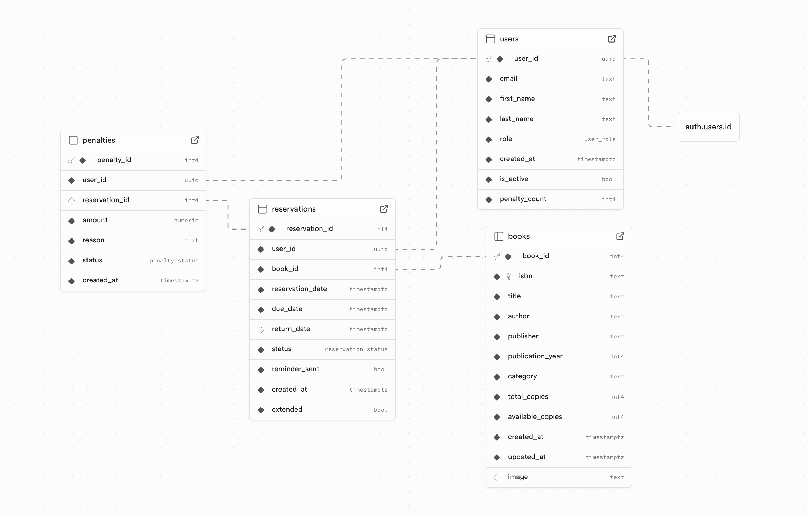

# SEP-R1
## Software Engineering Project - Group 1

### Overview
Library Hub is an accessible, user-friendly, and efficient digital library catalogue
system that simplifies the process of searching, borrowing, and returning books. The project aims to increase the efficiency of the library system by automating routine operations and
providing real-time updates on book availability, which supports user engagement and positive
outcomes.

## Technology Stack

### Development Tools
- **Version Control:** Git with GitHub
- **Framework:** Next.js 15
- **Styling** TailwindCSS, shadcn UI (lucide-react)
- **Backend as a Service:** Supabase (PostgreSQL Database, Authentication, S3 Storage Bucket)

### Design Tools
- **UI/UX Design:** Figma

### Testing Tools
- **Automated Testing Framework:** Jest + React Testing Library
- **Testing Coverage:** Jest Coverage Report

### Localization
- `i18next`: Core internationalization framework.
- `react-i18next`: React bindings for i18next.
- `next-i18n-router`: Next.js routing with i18n support.
- `i18next-resources-to-backend`: Backend plugin for loading localization resources.

### CI/CD
- Docker
- GitHub Actions
- Vercel

### Code Quality and Analysis
- **Linting Tool:** ESLint
- **Code Quality Tool:** SonarQube / SonarCloud

### Project Management
- **Project Management Software:** Jira

## Database 

This [document](https://github.com/vickneee/SEP-R1/blob/main/supabase/README.md) is Supabase CLI Guide.

Database schema:

## Localization

This [document](LOCALIZATION.md) explains how localization is implemented in the project.

## Docker

This [document](https://github.com/vickneee/SEP-R1/blob/main/DOCKER.md) explains how to build and run the library management system using Docker.

## SonarQube / SonarCloud

This [document](SONARQUBE.md) provides instructions on how to integrate SonarQube or SonarCloud into your project for continuous code quality inspection.

## Members
- Monami Kirjavainen
- Victoria Vavulina
- Riku Kaartoaho
- Riku Toivanen
